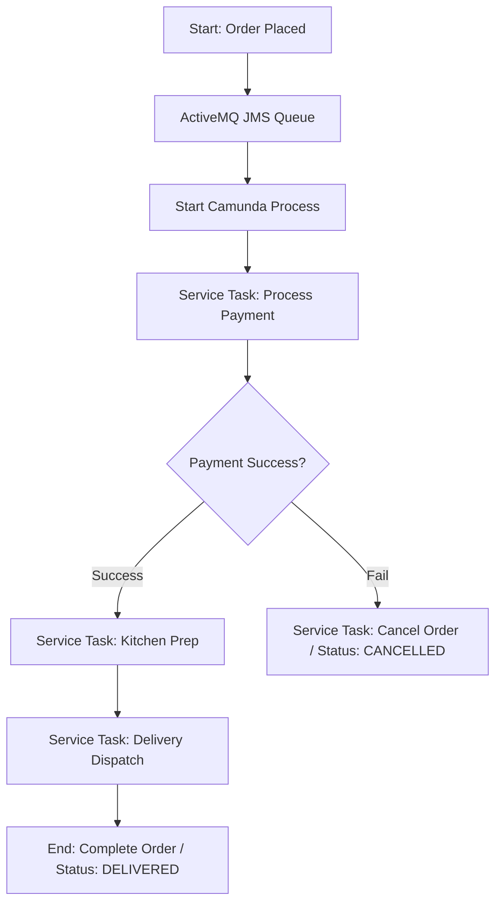

# Online Food Order Processing System (Microservices)

A high-fidelity distributed order processing system built using a **Database-per-Service** microservices architecture, featuring automated workflow orchestration, asynchronous messaging, and a real-time glowing dashboard interface.

> [!NOTE]
> This application was implemented, debugged, and verified with pair programming assistance from **Antigravity**, Google DeepMind's advanced agentic AI coding assistant.

---

## Architecture Overview

The system consists of five distinct components:

1.  **Order Service (`order-service` / Port `8081`)**:
    *   Acts as the central API gateway for order submissions.
    *   Hosts the **Camunda 7 Workflow Engine** to orchestrate the state machine.
    *   Includes an embedded in-memory ActiveMQ JMS broker for event-driven orchestration.
2.  **Payment Service (`payment-service` / Port `8082`)**:
    *   Subscribes to Camunda external tasks on topic `payment-processing`.
    *   Performs transactions and logs results into its private `payment_db`.
3.  **Kitchen Service (`kitchen-service` / Port `8083`)**:
    *   Subscribes to Camunda external tasks on topic `kitchen-preparation`.
    *   Registers tickets in `kitchen_db` and prepares food.
4.  **Delivery Service (`delivery-service` / Port `8084`)**:
    *   Subscribes to Camunda external tasks on topic `delivery-dispatch`.
    *   Assigns drivers and logs deliveries to `delivery_db`.
5.  **Frontend Dashboard (`frontend-ui` / Port `3000`)**:
    *   A premium dark-themed React SPA (Vite + CSS) polling the order service every 2 seconds for real-time status updates.

---

## State Machine Workflow



---

## Setup & Running the Application

### Prerequisites
*   Java 17 or higher
*   Node.js (for React frontend)
*   MySQL Server running locally

### Running the Backend Services
You can run all four applications directly inside IntelliJ IDEA via the Services tool window or by building from the terminal:
```bash
# Compile and package all services
mvn clean compile
```

Start the applications in this order:
1.  **`OrderServiceApplication`** (Port `8081`)
2.  **`PaymentServiceApplication`** (Port `8082`)
3.  **`KitchenServiceApplication`** (Port `8083`)
4.  **`DeliveryServiceApplication`** (Port `8084`)

### Running the Frontend
Navigate to the frontend folder, install dependencies, and run Vite:
```bash
cd frontend-ui
npm install
npm run dev
```
Open [http://localhost:3000](http://localhost:3000) in your browser.
